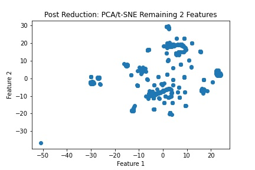
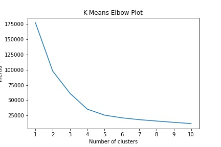
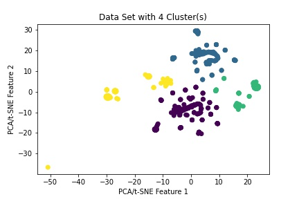

# unsupervised-machine-learning
This assignment consisted of using python, pandas, and sklearn to build a machine learning model and determining if a dataset can be clustered.

# What the code does (in general terms)
The **crypto_comparison.ipynb** code pre-processes the data by filtering for coin types that are have been mined and are currently being traded. Coin names and null values are removed, categorical data is converted to numeric, and the dataset is scaled.

Dimensionality is reduced using Principle Component Analysis (PCA) and T-distributed Stochastic Neighbor Embedding (t-SNE).

Cluster analysis is performed with k-means clustering.

# Analysis - Can the currently active CryptoCurrencies be clustered?
The currently active CryptoCurrencies (those being traded and that have mined a positive, non-zero number of coins) can be grouped into 4 (possibly 5) clusters.  This can be viewed when plotting the 2 remaining features after PCA and t-SNE dimension reductions have taken place. This can also be viewed in the K-Means elbow plot, and the two (2) scatter plots created using 4 and 5 clusters, respectively. The plots used in this analysis can be seen below.

Comparison Plot of Features After Dimensionality Reduction:

K-Means Elbow Plot:

K-Means with 4 (four) clusters:

K-Means with 5 (four) clusters:
